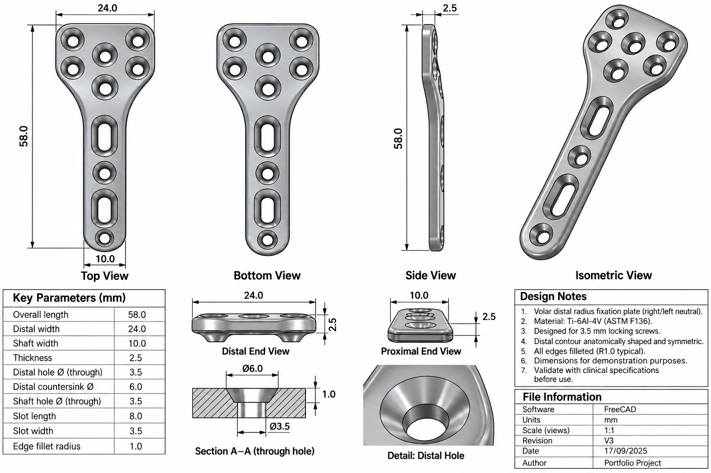
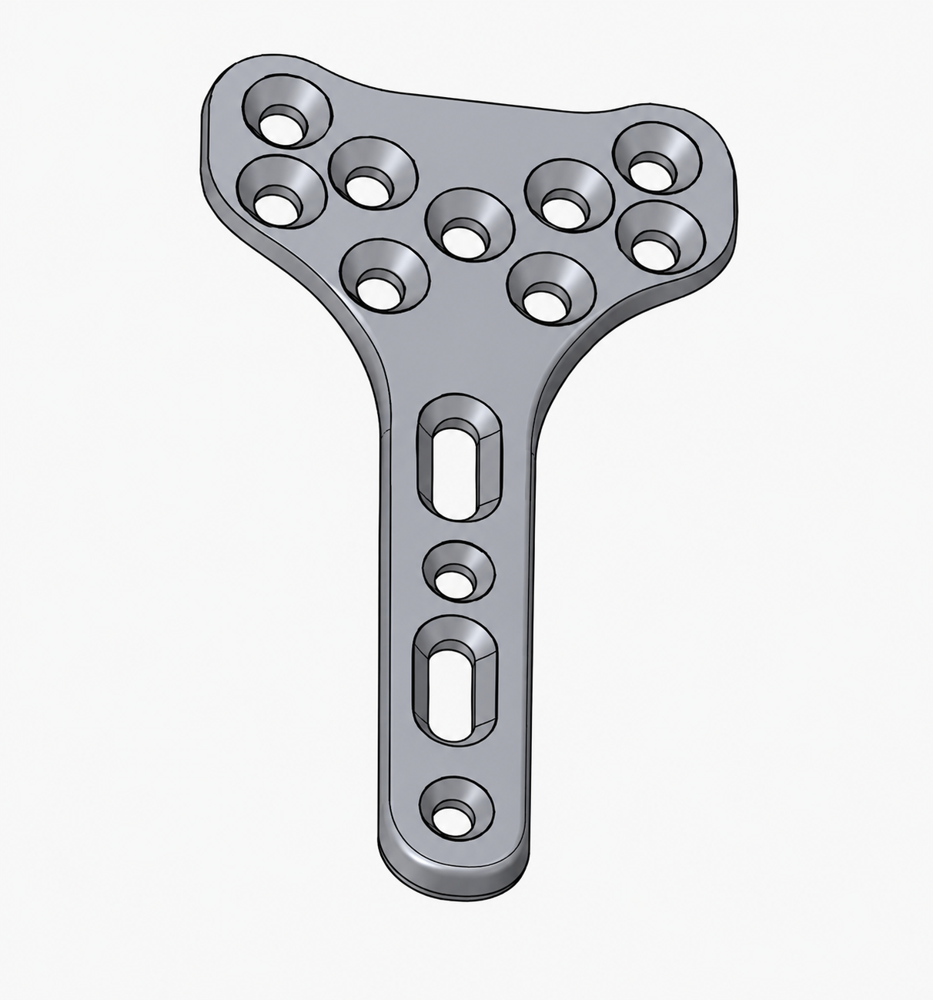

# Bone Plate Modelling: Volar Distal Radius Fixation Plate

A parametric 3D CAD model of a volar distal radius fixation plate, the orthopaedic
implant used to stabilise a fractured distal radius (the wrist end of the forearm
bone). Modelled in FreeCAD with a full parametric definition, orthographic
engineering drawings, and dimensioned features.

**Domain:** orthopaedic implant design, parametric CAD, engineering drawing
**Tool:** FreeCAD (parametric Python macro)
**Material intent:** Ti-6Al-4V (ASTM F136), designed for 3.5 mm locking screws

**Competencies demonstrated:** parametric 3D modelling, engineering drawing and orthographic projection, dimensioning and sectioning, orthopaedic device geometry, material and standards awareness

---

## Overview

A volar distal radius plate is fixed to the palm-side surface of the radius to
hold a fracture in alignment while it heals. Its geometry is functionally
demanding: a broad distal head that sits under the joint surface and carries a
cluster of locking-screw holes, narrowing to a shaft that follows the bone with
compression slots and further screw holes, and a low, fully-filleted profile so
the plate sits close to the bone without irritating soft tissue.

This project models that implant parametrically in FreeCAD. Every critical
dimension is driven by a parameter, so the plate can be regenerated or resized by
editing values rather than redrawing geometry, and the model is documented with a
full set of orthographic views, a dimensioned parameters table, a section view
through a screw hole, and a detail view.

## Engineering drawing

The model is presented as a formal drawing sheet, with top, bottom, side, and
isometric views, a dimensioned parameters table, a section through a countersunk
hole, and a detail of the distal hole.

*Figure 1. Engineering drawing of the volar distal radius fixation plate: orthographic views (top, bottom, side, isometric), key dimensions, Section A-A through a countersunk hole, and a distal-hole detail.*

*Figure 2. Isometric render showing the T-shaped distal head with its locking-hole cluster, the compression slots along the shaft, and the countersunk holes.*

## Key parameters

The model is fully parametric. The principal dimensions are:

*Table 1. Principal parametric dimensions of the plate.*

| Parameter | Value |
|---|---|
| Overall length | 58.0 mm |
| Distal width | 24.0 mm |
| Shaft width | 10.0 mm |
| Thickness | 2.5 mm |
| Distal / shaft hole diameter | 3.5 mm (through) |
| Countersink diameter | 6.0 mm |
| Slot length x width | 8.0 x 3.5 mm |
| Edge fillet radius | 1.0 mm |

## Design features

- **Distal locking-hole cluster.** Countersunk holes arranged across the broad
  T-head, positioned to place screws in the subchondral bone just under the joint
  surface, which is where fixation strength matters most in a distal radius
  fracture.
- **Compression slots along the shaft.** Obround slots that let the surgeon
  adjust plate position and apply compression across the fracture before the
  screws are locked.
- **Countersunk holes.** A 6.0 mm countersink over each 3.5 mm through-hole so
  screw heads sit flush with the plate surface, keeping the profile low.
- **Anatomically shaped, symmetric head.** The distal head flares and is
  contoured to match the volar surface of the radius, and is right/left neutral.
- **Fully filleted edges (R1.0).** Every edge is radiused to reduce soft-tissue
  irritation and remove stress-concentrating sharp corners.

## Parametric source

The model is generated by a FreeCAD Python macro, included in
[`source/volar_distal_radius_plate.py`](source/volar_distal_radius_plate.py). The
macro defines the plate parametrically: helper functions build the countersunk
holes and obround slots, a mirrored half-profile creates the symmetric outline,
and the features are cut and filleted from the parameter set. Editing the
parameter block at the top regenerates the whole plate, so it can be resized or
adjusted without redrawing.

*Note: the source macro is a clean, runnable reconstruction of the parametric
definition documented on the drawing sheet; parameter values and feature logic
match the drawing.*

## Material and standards

The plate is intended to be manufactured in Ti-6Al-4V titanium alloy to ASTM
F136 (the standard for wrought titanium for surgical implants), and is designed
around 3.5 mm locking screws. As a modelling exercise, the geometry demonstrates
the design; clinical dimensions and mechanical performance would require
validation against a device specification and finite-element analysis before any
real use.

## Further work

Planned extensions include finite-element analysis of the plate under
physiological loading, refinement of the anatomical contour against radius
surface data, and a screw-and-plate assembly model. Further modelling projects
will be added to this discipline.
