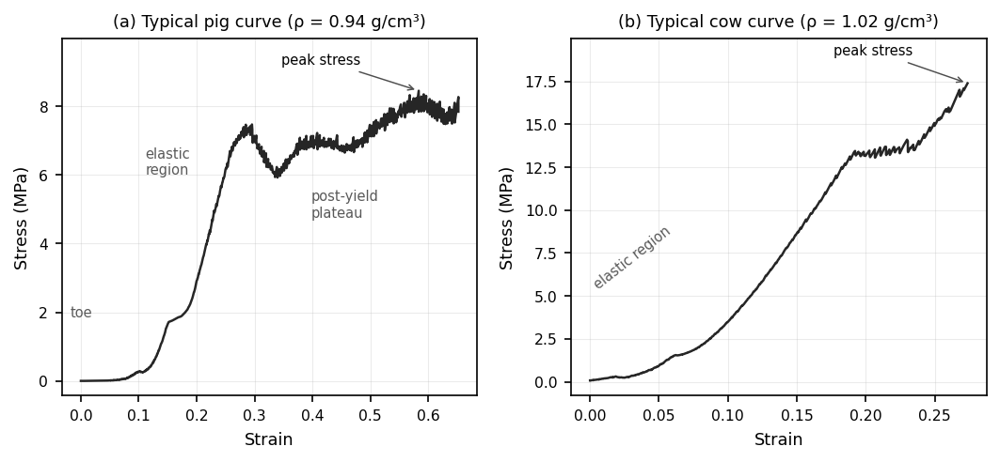
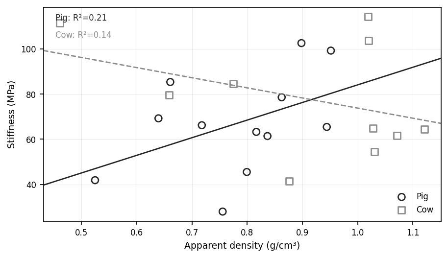
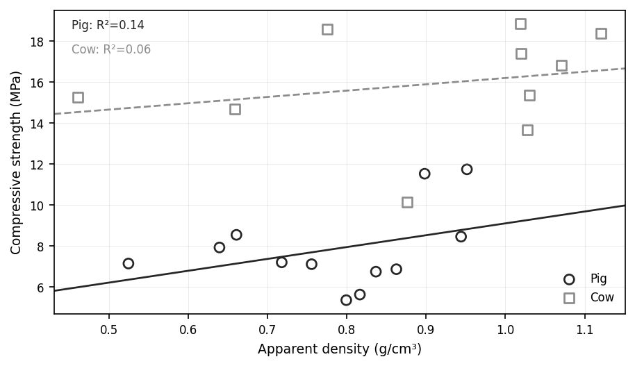
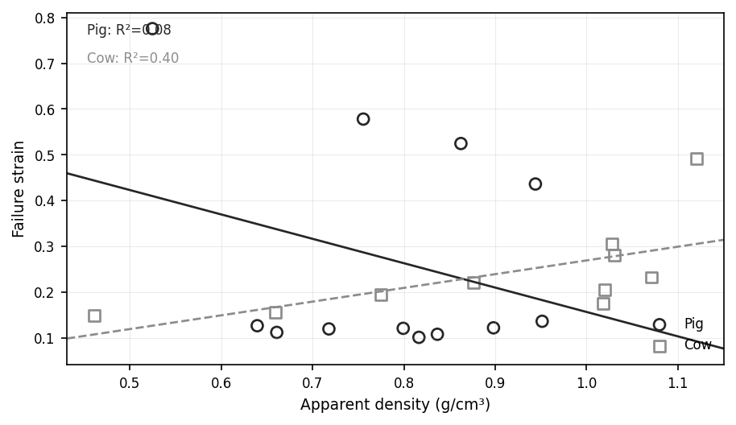

# Mechanical Testing of Cancellous Bone: A Density-Corrected Species Comparison

Uniaxial compression testing of porcine and bovine cancellous bone, analysing
whether the two species differ in stiffness, compressive strength, or failure
strain once apparent density is accounted for.

**Domain:** biomechanics · materials testing · mechanical characterisation
**Testing:** uniaxial compression of cancellous bone cores
**Analysis:** Python (property-density regression, hypothesis testing)
**Dataset:** 12 porcine and 10 bovine specimens

**Competencies demonstrated:** mechanical testing and stress-strain analysis · property-density regression · statistical comparison (t-tests, R²) · interpretation against materials theory · honest treatment of data quality and limitations

---

## Overview

Cancellous (trabecular) bone is a porous, foam-like material whose compressive
behaviour is governed largely by apparent density and trabecular architecture.
Under load it behaves like a rigid cellular solid: a toe region, a linear
elastic region, a peak stress, and a post-yield plateau as trabeculae collapse.

A common assumption is that apparent density alone explains cancellous bone
mechanics, so that different species can be treated as equivalent at matched
density. This study tests that assumption directly, asking whether pig and cow
cancellous bone differ in stiffness, strength, or failure strain **after**
correcting for density, a question with practical weight for choosing animal
models in orthopaedic research.

Twelve porcine and ten bovine cores were tested in uniaxial compression.
Stiffness, compressive strength, and failure strain were extracted from each
stress-strain curve, then analysed against apparent density both within and
between species. The specimen dataset is in [`data/`](data/).

## Stress-strain behaviour

Both species produced the response characteristic of cancellous bone. Figure 1
shows a representative curve from each, with the toe, elastic region, peak
(compressive strength), and post-yield plateau annotated. The cow specimen
reaches a higher peak stress, foreshadowing the strength result below.

*Figure 1. Representative stress-strain curves for a pig and a cow specimen of comparable density, plotted from the recorded test data.*

## Method summary

For each specimen, apparent density was calculated as marrow-free mass over bulk
cylindrical volume (including pore space). From each stress-strain curve:

- **Stiffness:** slope of the linear elastic region (E = Δσ/Δε)
- **Compressive strength:** peak stress (or stress at 10% strain where no clear peak was present)
- **Failure strain:** strain at peak stress

Each property was then fitted against apparent density per species (power law
*property = a·ρ^b*, via log-linear regression), and the two species were
compared both by raw means and across a common density band.

## Results

### Summary of mechanical properties

Cow specimens had a higher mean apparent density and a markedly higher mean
compressive strength; stiffness was somewhat higher for cows with overlapping
spread, and failure strain was similar between species.

| Property | Pig (n = 12) | Cow (n = 10) |
|---|:---:|:---:|
| Apparent density (g/cm³) | 0.78 ± 0.13 | 0.91 ± 0.21 |
| Stiffness (MPa) | 67.21 ± 22.22 | 77.99 ± 25.03 |
| Compressive strength (MPa) | 7.85 ± 2.01 | 15.92 ± 2.70 |
| Failure strain | 0.27 ± 0.24 | 0.24 ± 0.10 |

*Table 1. Mechanical properties by species (mean ± standard deviation).*

### Property-density relationships

Both species are plotted on common axes so they can be compared directly and
over the same density range.

*Figure 2. Stiffness against apparent density, both species, with per-species trendlines and R².*

Stiffness increased weakly with density in pigs (R² = 0.21). The cow trendline
is slightly negative (R² = 0.14), which is not physically meaningful, and is addressed
below as a small-sample artefact rather than a real inverse relationship.

*Figure 3. Compressive strength against apparent density, both species.*

Strength depends only weakly on density within each species (pig R² = 0.14; cow
R² = 0.06). The striking feature is the **vertical separation between species**:
at any given density the cow specimens lie well above the pig specimens, and the
cow trendline sits entirely above the pig one across the whole density range.

*Figure 4. Failure strain against apparent density, both species.*

Failure strain showed no consistent density dependence in pigs (R² = 0.08); the
cow trend (R² = 0.40) is influenced by one high-strain specimen and treated
cautiously.

| Property | Pig R² | Cow R² | Pig exponent b | Cow exponent b |
|---|:---:|:---:|:---:|:---:|
| Stiffness | 0.21 | 0.14 (neg.) | +0.85 | −0.46 |
| Strength | 0.14 | 0.06 | +0.37 | +0.12 |
| Failure strain | 0.08 | 0.40 | −0.95 | +0.87 |

*Table 2. Fit statistics for property vs apparent density, by species.*

### Species comparison

Raw means compared with Welch's t-test: **compressive strength differs highly
significantly** (t = −7.81, p < 0.001), cow stronger; stiffness does not
(p = 0.30), nor failure strain (p = 0.69) nor mean density (p = 0.14).

Because the species differ in density distribution (cow bone reaches higher
densities), a second comparison was made over the overlap band (≈0.66–0.95
g/cm³), judging any residual effect at matched density. There, **stiffness is
essentially identical** (pig 66.25 vs cow 63.00 MPa) while **cow strength
remains roughly double pig strength** (14.37 vs 7.49 MPa).

> **The density correction cuts both ways.** For stiffness, the apparent species
> difference reflects the density difference between groups and disappears once
> density is matched. For strength, it does not: cow bone is stronger than pig
> bone at the same apparent density, so density alone does not explain
> compressive strength across these species.

## Interpretation

Apparent density is an important but **incomplete** predictor of cancellous bone
mechanics. It accounts for stiffness, consistent with the cellular-solid model
(Gibson, 1985) and the density-scaling framework of Carter and Hayes (1977),
but it does not account for the higher compressive strength of bovine bone. That
residual strength difference points to species differences in trabecular
architecture (orientation, connectivity, anisotropy) beyond bulk density, as
argued by Keaveny, Morgan and Yeh (2001) and Turner (2002).

The weak within-species correlations are themselves meaningful: each species
spans only a narrow density range, so density-driven variation is small relative
to biological scatter, and the fitted exponents (mostly below 1) are lower than
the ~2 to 3 reported over wider ranges, a consequence of range and sample size,
not a contradiction of the literature.

**The negative cow stiffness trend** (Figure 2) is an artefact: two low-density
cow specimens recorded high stiffness, and with only ten specimens these tilt the
line negative. The near-zero R² confirms density explains almost none of the
variance, so the slope's sign is not meaningful.

## Conclusion

- Apparent density is associated with stiffness; the apparent species difference in stiffness disappears at matched density.
- Cow cancellous bone is significantly stronger than pig bone (15.92 vs 7.85 MPa; p < 0.001), and this **persists at matched density**, indicating a species difference in architecture beyond bulk density.
- Failure strain shows no consistent species difference.
- **Practical implication:** pig and cow cancellous bone may be treated as broadly equivalent in stiffness at matched density, but **not in strength**; strength-critical work requires species-specific data.

## Limitations and further work

- Small, density-limited samples (12 pig, 10 cow) give the fits low power, and few cow specimens fall in the overlap band.
- Specimens came from several preparation sessions, a possible source of variability confounded with species.
- Apparent density does not capture trabecular architecture, which the strength result implicates; micro-CT would test this directly.

Future work would enlarge and balance the sample across a wider density range,
standardise preparation within one session, and add micro-CT architectural
analysis to test whether trabecular structure explains the residual strength
difference.

## Data

- [`data/specimen_properties.csv`](data/specimen_properties.csv): apparent density, stiffness, strength, and failure strain for all 22 specimens.

## References

- Carter, D.R. and Hayes, W.C. (1977) 'The compressive behavior of bone as a two-phase porous structure', *Journal of Bone and Joint Surgery*, 59A(7), pp. 954–962.
- Gibson, L.J. (1985) 'The mechanical behaviour of cancellous bone', *Journal of Biomechanics*, 18(5), pp. 317–328.
- Keaveny, T.M., Morgan, E.F. and Yeh, O.C. (2001) 'Trabecular bone strength relies on density and architecture', *Journal of Biomechanics*, 34, pp. 699–708.
- Ryan, S. and Williams, J. (1989) 'Mechanical testing of cancellous bone: influence of density and structure', *Bone*, 10(5), pp. 421–428.
- Turner, C.H. (2002) 'Biomechanics of bone: density-mechanics relationships revisited', *Bone*, 31(4), pp. 555–556.
