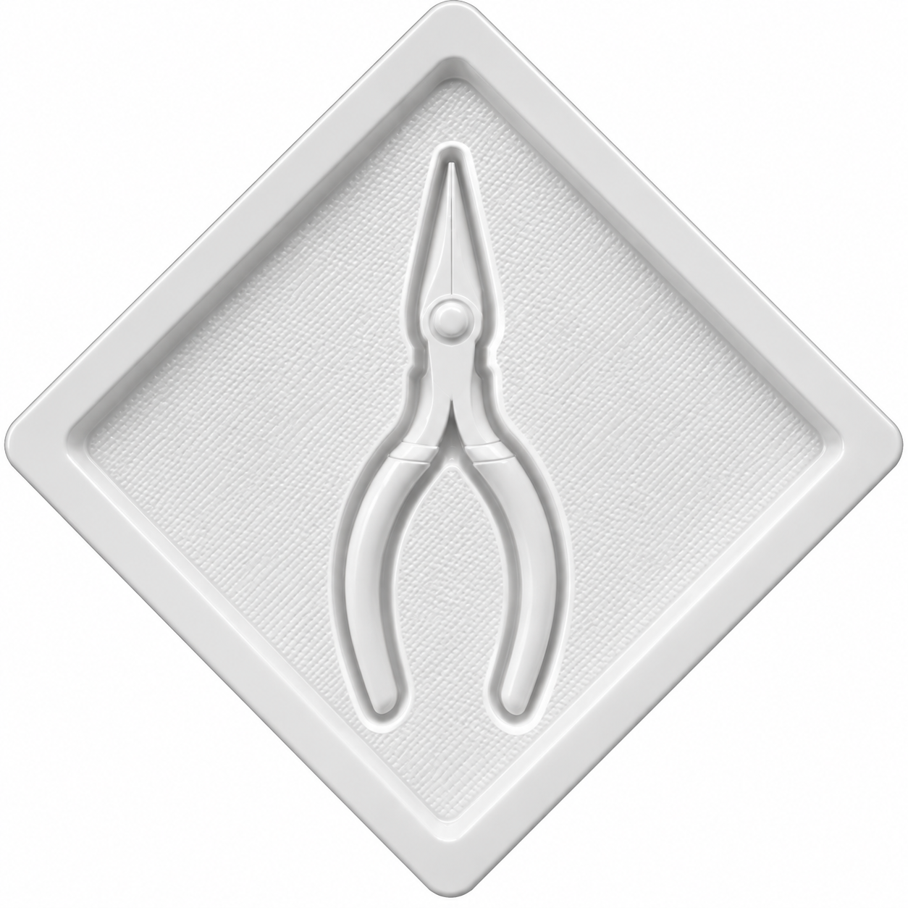

# Packaging Design: Vacuum-Formed Instrument Trays

Vacuum-formed (thermoformed) packaging designed to hold surgical or precision
instruments securely in a moulded tray, with cavities shaped to each tool.

**Domain:** packaging design, vacuum forming / thermoforming, design for manufacture
**Scope:** packaging design only (the instruments themselves are existing tools)

**Competencies demonstrated:** thermoform packaging design, cavity and draft design, design for a forming process, protective packaging for precision instruments

---

## Overview

Vacuum forming (thermoforming) heats a plastic sheet and draws it over a mould so
it takes the mould's shape, producing a rigid tray with cavities that cradle a
product. It is widely used for medical device and instrument packaging because it
holds each item in a fixed, presented position, protects it in transit, and
supports a clean, single-use presentation.

This project covers the design of vacuum-formed trays to hold two precision
instruments. The design work is the packaging: the cavity for each tool, the
surrounding tray, and the geometry needed for the forming process. The
instruments held are existing tools, not part of this design.

## The trays

Each tray is shaped to hold one instrument in a recessed cavity that follows the
tool's outline, surrounded by a flanged rim.

*Figure 1. Vacuum-formed tray with a cavity shaped to a driver-type instrument (a handled tool with a round head and a long shaft).*

*Figure 2. Vacuum-formed tray with a cavity shaped to a pliers-type instrument (a hinged, two-handled tool with slender tapering jaws).*

## Design considerations

The packaging design addresses the requirements of the forming process and the
function of the tray:

- **Cavity shaped to the tool.** Each recess follows the instrument's outline so
  the tool is held in a fixed position and does not move within the pack.
- **Draft on the cavity walls.** The walls are angled so the formed part releases
  cleanly from the mould, which is essential for a vacuum-formed part.
- **Flanged rim.** The surrounding flange stiffens the tray and provides a sealing
  or lidding surface for a covering film.
- **Textured base.** A textured cavity floor reduces contact area and sticking,
  and helps the part release.

## Note on scope and identification

The instruments shown are existing tools; this project is the packaging designed
to hold them, not the tools. The tools are described here by their general form
(a driver-type instrument and a pliers-type instrument) rather than a specific
product name.

## Further work

Further packaging projects will be added to this discipline, including additional
thermoformed trays and related design-for-manufacture work.
