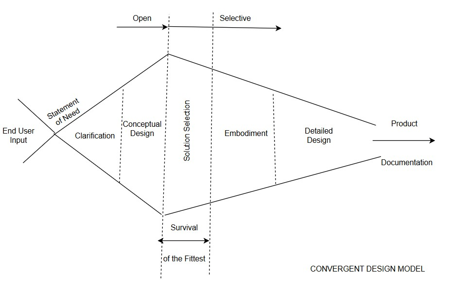

# Design Control Methodologies for a Medical Device Translation Guidance Resource

A critical analysis of the design control process behind a guidance resource
that walks university academics and researchers through the full medical device
translation pathway, from concept design through regulatory approval, clinical
validation, patient access, and device disposal. The analysis covers the
convergent design model, development of a Statement of Need from end-user
engagement, translation into a design specification (XDS), and structured
concept selection against international quality and regulatory frameworks.

**Domain:** design controls, medical device quality and regulatory affairs
**Frameworks applied as constraints:** ISO 13485, FDA 21 CFR 820 principles, EU/UK Medical Device Regulations, ISO 62366-1
**Scope:** early-phase design control (need identification, specification, concept selection)

**Competencies demonstrated:** cross-functional team leadership and coordination, design control methodology, design documentation and record-keeping, requirements definition and traceability, structured concept selection (weighted pairwise comparison), regulatory and standards awareness

---

## Scope and contribution

This piece analyses a design control study carried out by a multidisciplinary
postgraduate team (medical engineers, clinicians, psychologists,
neuroscientists, and chemical engineers). The ideas, needs, and concepts were
generated collaboratively by the team; the analysis presented here is an
individual critical evaluation of the design control methodology, documentation,
and decision-making.

Within the team I took the coordinating lead of a self-organising,
cross-functional group: convening and running the meetings, and reviewing each
deliverable before it was submitted to the project leadership for sign-off. My
individual output was the design control documentation, structuring the team's
collaborative input into the formal controlled artefacts a quality system
requires: the Statement of Need document, the Product Design Specification
(XDS), the design review meeting records, the final selected-idea document with
its weighted selection criteria, the literature review, and the team skills
matrix.

It is included here to demonstrate two competencies central to medical device
development: the coordination of a cross-functional team through a structured
design process, and design control literacy, the disciplined translation of user
needs into specifications and defensible, traceable design decisions under a
quality management framework. The resource being designed addresses a validated,
unmet need: focus groups and expert consultation confirmed that no unified,
publicly accessible resource exists to guide academic researchers through the
entire lab-to-patient pathway, so the project set out to define one. Regulatory
frameworks were applied as guiding constraints, not as claims of regulatory
compliance.

The full analysis is available as a PDF:
[Design_Control_Methodologies.pdf](Design_Control_Methodologies.pdf).

## The design control process

The study followed a convergent design model, chosen over linear alternatives
(Waterfall, Pugh's Total Design) because early-phase medical device design
requires iterative clarification of needs and progressive narrowing of the
solution space rather than premature specification freeze.

*The convergent design model: iterative narrowing from end-user input and the Statement of Need through to a selected concept.*

The process moved through four connected stages:

1. **Statement of Need.** Developed from structured focus-group engagement with
   representative end-users, with the team's qualitative input synthesised into
   clear, auditable need statements. This is the design input that anchors
   everything downstream; I authored the controlled document that captured it.
2. **Design specification (XDS).** The Statement of Need was translated into a
   formal, controlled design specification covering functional performance,
   usability, regulatory considerations, data protection, sustainability, and
   content structure.
3. **Essential specification selection.** Twelve essential specifications were
   selected from the wider XDS as the criteria most able to differentiate
   between competing concepts while preserving alignment with user needs.
4. **Concept selection.** Five concepts were evaluated against those twelve
   specifications using a structured pairwise comparison, with cumulative scoring
   to identify the most robust solution.

## Outcome

The pairwise comparison produced a clear winner: an offline-first application
with accessibility modes and regulatory intelligence tools scored 42.5 against
the next-best 29, and was selected as the primary concept. Gaps were then closed
by integrating elements from other concepts (interactive infographics, hard-copy
playback, staged pathway control with expert review). The resulting concept is an
offline-capable, accessibility-driven regulatory and design companion for the
full medical device development lifecycle.

The key methodological point is traceability: because the selection criteria
derived directly from the Statement of Need, the final decision was traceable
back to validated user needs rather than subjective preference, which is exactly
the discipline that regulated medical device development (ISO 13485) requires.

## Design and development records

The study produced a full set of design control artefacts, forming the design
and development records that would feed the device's Technical File under EU/UK
MDR (the equivalent of a Design History File under FDA 21 CFR 820): statement of
need, design specification, team skills matrix, literature review, idea
generation and selection records, project plan, focus group report, and design
review meeting records, together with a consolidated list of controlled
documents. As the project is at an early, ongoing phase, these are maintained as
a live Technical File rather than a closed record. This mirrors the
documentation structure expected under a medical device quality management
system.

## Future work

The analysis identifies the next steps toward a compliant development pathway:
expanding traceability documentation, conducting formal risk management (ISO
14971), and progressing to detailed design, verification, and validation under
ISO 13485 and EU/UK Medical Device Regulation requirements.
