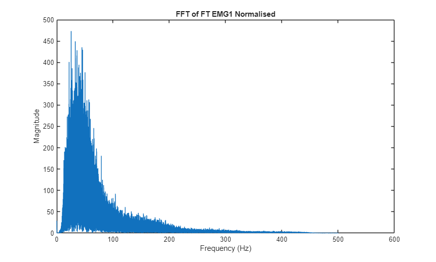
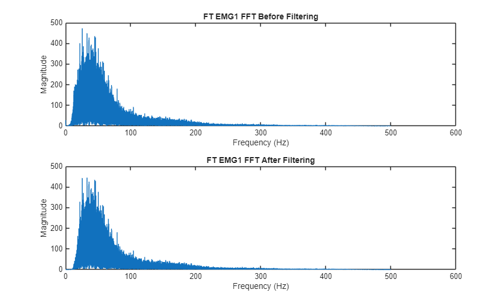
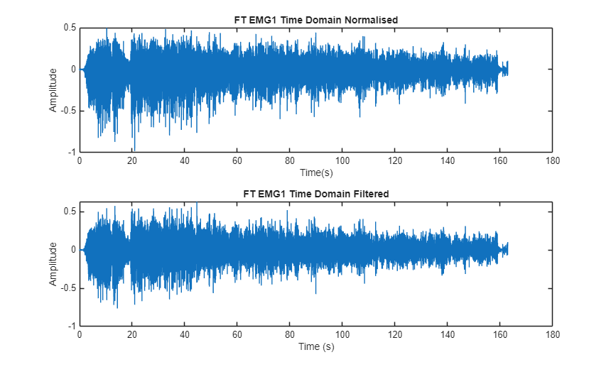
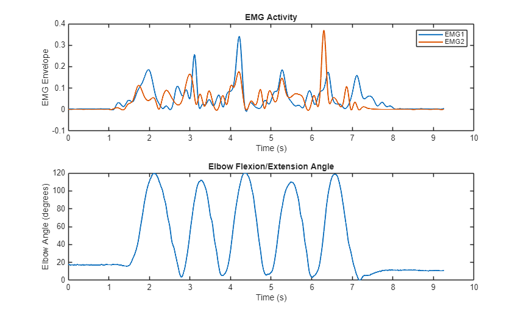
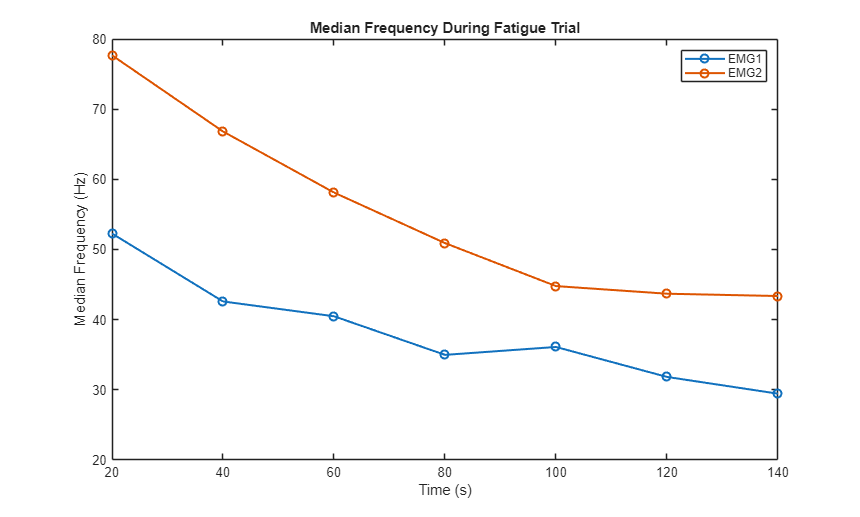

# Surface EMG Signal Processing and Analysis

A MATLAB analysis of surface electromyography (sEMG): normalisation, digital
filtering, muscle activation, muscle identification, and quantitative fatigue
assessment.

**Domain:** biomedical signal processing - electromyography
**Platform:** MATLAB (Signal Processing Toolbox)
**Signals:** EMG (two channels), goniometer, mass
**Trials:** Maximum Voluntary Contraction (MVC) · Repeated Flexion-Extension (RFE) · Fatigue Trial (FT)

**Competencies demonstrated:** digital filter design · frequency-domain analysis (FFT, median frequency) · feature extraction · signal integrity · validation against physiology · MATLAB programming

---

## Overview

Surface electromyography detects the electrical signals produced by skeletal
muscles during contraction. These signals are low-amplitude and easily
corrupted by motion, noise, and interference, so reliable measurement depends
on careful filtering followed by a processing chain that extracts meaningful
features.

This project takes three recorded trials from raw signal through to
interpretation:

- **MVC** establishes each channel's peak output, used as the normalisation reference.
- **RFE** is used to identify which muscle each channel records, by comparing activation against elbow angle.
- **FT** is used to quantify muscular fatigue through the shift in median frequency.

The full pipeline is: **load → normalise → FFT → Butterworth band-pass filter
→ time-domain verification → rectify + envelope → goniometer processing →
muscle identification → median-frequency fatigue analysis.**

The complete, runnable script is in [`code/emg_analysis.m`](code/emg_analysis.m).
All 17 figures are in [`figures/`](figures/); the key ones are shown below.

---

## 1. Normalisation

Each channel is normalised to the maximum of its MVC envelope, expressing
subsequent activity as a fraction of peak muscle output so the trials become
comparable. Normalisation only rescales the signal, it does not change its
shape.

```matlab
[MVC_EMG1_upper,MVC_EMG1_lower] = envelope(MVC_EMG1);
MVC_EMG1_max = max(MVC_EMG1_upper);
FT_EMG1_normalised = FT_EMG1 / MVC_EMG1_max;
```

## 2. Frequency-domain examination

An FFT of the normalised signal shows the spectral content and informs the
filter design. Most signal energy sits below 450 Hz, with a concentration near
0 Hz; the 1000 Hz sampling rate gives a 500 Hz Nyquist limit.



*FFT of the normalised fatigue-trial EMG1 signal.*

## 3. Butterworth filtering

A 20–450 Hz band-pass filter is applied as a fourth-order Butterworth,
implemented as a high-pass stage followed by a low-pass stage.

```matlab
Fs = 1000; high_cutoff = 20; low_cutoff = 450; filter_order = 4;

[b_hp,a_hp] = butter(filter_order, high_cutoff/(Fs/2), 'high');
EMG_HP = filter(b_hp, a_hp, EMG_normalised);

[b_lp,a_lp] = butter(filter_order, low_cutoff/(Fs/2));
EMG_filtered = filter(b_lp, a_lp, EMG_HP);
```

> **Design rationale.** The 20 Hz high-pass cutoff removes motion artefact and
> baseline drift, which dominate the near-DC content seen in the spectrum. The
> 450 Hz low-pass cutoff sits below the 500 Hz Nyquist limit while retaining the
> dominant EMG energy. A fourth-order Butterworth was chosen for its maximally
> flat passband and steep roll-off, separating the physiological signal from
> low-frequency artefact and high-frequency noise without amplitude ripple,
> and without the phase distortion higher orders introduce, which matters
> because activation timing must be preserved. (Cutoff choices follow De Luca
> et al., 2010 and Potvin, 1997.)



*FFT before and after filtering: unwanted low- and high-frequency components are reduced while the dominant EMG content is retained.*

## 4. Time-domain verification

Comparing the signal before and after filtering in the time domain confirms
that noise and baseline fluctuation are reduced while the timing of muscle
activity is preserved.



*Normalised (top) and filtered (bottom) fatigue-trial EMG1.*

## 5. Muscle identification

The filtered RFE signals are rectified and a peak envelope extracted
(separation parameter 80). The goniometer signal is inverted and rescaled to a
0–120° elbow angle, and the two envelopes are compared against joint angle.

```matlab
RFE_EMG1_rectified = abs(RFE_EMG1_filtered);
[RFE_EMG1_upper,RFE_EMG1_lower] = envelope(RFE_EMG1_rectified,80,'peak');

RFE_angle = (RFE_Goniometer_inverted - min(RFE_Goniometer_inverted)) ...
    / (max(RFE_Goniometer_inverted) - min(RFE_Goniometer_inverted));
RFE_angle = RFE_angle * 120;
```



*EMG envelope activity (top) against elbow flexion/extension angle (bottom).*

EMG1 shows greater activity during flexion toward 120°, and EMG2 during
extension toward 0°.

> **Validation.** The identification is corroborated by physiology rather than
> asserted: the biceps brachii is the primary elbow flexor and the triceps
> brachii the primary extensor, so the observed activation timing relative to
> joint angle is an independent check that the pipeline produced a
> physiologically correct result. **EMG1 = biceps brachii; EMG2 = triceps
> brachii.** A small constant phase delay shifts each envelope slightly in time
> but, being constant, does not affect which muscle dominates in each phase.

## 6. Fatigue analysis

Muscular fatigue shifts the signal's median frequency downward. Seven 10-second
segments are taken from the Fatigue Trial (starting at 20, 40, …, 140 s) and
the median frequency of each computed with `medfreq`.

```matlab
FT_EMG1_20 = FT_EMG1_filtered(20001:30000);
MF_EMG1_20 = medfreq(FT_EMG1_20,Fs);
% ... repeated for each 10-second segment, both channels ...
fatigue_time = [20 40 60 80 100 120 140];
```



*Median frequency across the fatigue trial, both channels.*

Median frequency falls from **52.3 Hz to 29.5 Hz (EMG1)** and from **77.7 Hz to
43.4 Hz (EMG2)** between 20 and 140 s. The downward trend in both channels is
the expected signature of fatigue: as fibre conduction velocity decreases, the
power spectrum shifts to lower frequencies (De Luca et al., 2010; Hering et
al., 1989). EMG2 stays consistently higher than EMG1, consistent with the
triceps' higher fibre conduction velocity.

---

## Results

- Band-pass filtering reduced unwanted low- and high-frequency components while preserving the dominant EMG content.
- EMG1 showed greater activity during flexion; EMG2 during extension.
- **EMG1 = biceps brachii, EMG2 = triceps brachii**, consistent with their agonist–antagonist roles.
- Median frequency fell in both channels (EMG1 52.3→29.5 Hz; EMG2 77.7→43.4 Hz), consistent with developing fatigue.

## Limitations and further work

- Single recording session ; results characterise this dataset, not a population.
- Median-frequency estimation assumes approximate stationarity within each 10-second window.
- Electrode placement and skin preparation were taken as given, not independently verified; normalisation to MVC mitigates but does not remove this.
- Cross-talk between adjacent muscles was not explicitly quantified.

Further work would extend the pipeline across multiple subjects and sessions,
add explicit signal-quality checks at acquisition, and quantify measurement
uncertainty on the extracted features.

---

## Running it

Requires MATLAB with the Signal Processing Toolbox. Place the three trial data
files (`Fatigue_Trial.mat`, `Maximum_Voluntary_Control.mat`,
`Repeated_Flexion_Extension.mat`) in the same folder as the script, then run:

```matlab
emg_analysis
```

The script regenerates all 17 figures. Data files are not included in this
repository.

## References

- De Luca, C.J., Gilmore, L.D., Kuznetsov, M. and Roy, S.H. (2010) 'Filtering the surface EMG signal: movement artifact and baseline noise contamination', *Journal of Biomechanics*, 43(8), pp. 1573–1579.
- Hering, G., Hennig, E.M. and Riehle, H.J. (1989) 'Measurements of muscle fiber conduction velocity at the M. biceps and M. triceps brachii under isometric load', *Journal of Biomechanics*, 22(10), p. 1021.
- Potvin, J.R. (1997) 'Effects of muscle kinematics on surface EMG amplitude and frequency during fatiguing dynamic contractions', *Journal of Applied Physiology*, 82(1), pp. 144–151.
