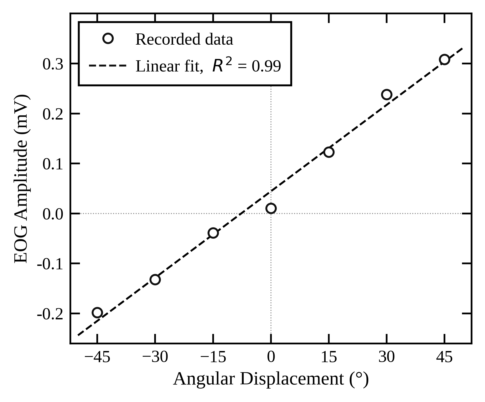

# Electrooculography: Recording and Analysis of Eye Movements

Recording and analysis of eye movements using surface electrodes, covering
electrode setup, angular calibration, artefact identification, and the
measurement of saccades, smooth pursuit, and gaze-holding reflexes.

**Domain:** biosignal acquisition and instrumentation, physiological measurement
**Equipment:** ADInstruments EOG Pod (ML317), PowerLab 15T, Ag/AgCl electrodes
**Standards referenced:** ISCEV clinical EOG standard (2017), IEC 60601-1
**Signal:** electrooculogram (corneoretinal potential), horizontal canthal derivation

**Competencies demonstrated:** biosignal acquisition and electrode instrumentation, sensor calibration, artefact identification and characterisation, physiological signal interpretation, measurement-standards awareness, technical scientific writing

---

## Overview

Electrooculography (EOG) records eye position by detecting the corneoretinal
potential, the standing electrical difference between the positively charged
cornea and the negatively charged retina. As the eye rotates, this dipole shifts
and surface electrodes around the eye detect the resulting voltage change. EOG
needs only surface electrodes and an amplifier, which makes it far more
accessible than video-oculography, at the cost of susceptibility to artefacts
from blinks, jaw clenching, and head movement.

This study recorded and analysed EOG across six tasks: baseline zeroing, artefact
recognition, angular calibration, saccadic recording during reading, smooth
pursuit, and gaze-holding (vestibulo-ocular and optokinetic reflexes). The tasks
were ordered deliberately, establishing a clean, calibrated signal first so that
the later recordings were directly interpretable.

The full paper (IEEE format, with methods, results, discussion, and 21
references) is available as a PDF:
[EOG_Eye_Movement_Analysis.pdf](EOG_Eye_Movement_Analysis.pdf).

## Calibration

Calibration converted raw EOG voltage into gaze angle. Fixating targets at known
angles across the full range gave a strongly linear relationship between EOG
amplitude and gaze angle (R squared = 0.99), with a sensitivity of 5.76 microvolts
per degree. This calibration made every subsequent recording interpretable in
angular terms.

*EOG amplitude against angular displacement. Open circles are recorded data; the dashed line is the linear fit (R squared = 0.99, slope 5.76 microvolts per degree).*

A slight compression at the extremes reflected the physical limits of lateral eye
movement. The measured sensitivity is lower than the roughly 20 microvolts per
degree reported for clinical configurations, which is expected: the compact
canthal electrode placement captures a smaller fraction of the dipole field than
wider periorbital setups, so sensitivity values cannot be compared across studies
without knowing the electrode configuration. This is an instrumentation effect,
not a measurement error.

## What the recordings showed

- **Artefacts.** Three artefact types were identified and characterised by their
  distinct signatures: blinks (short biphasic deflections), tight eye closure
  (sustained high-amplitude disturbance), and teeth clenching (high-frequency EMG
  bursts). Each has a specific physiological origin, and each is clinically
  relevant: the teeth-clench EMG signal, for instance, could be mistaken for
  retinal dysfunction, yet the same signal is deliberately used as a control
  command in EOG-based assistive devices.
- **Saccades during reading.** The recorded signal showed repeated rapid
  deflections as the reader moved through text, with the largest deflection at the
  end-of-line return sweep. The measured reading intervals capture gaze-shift
  events, not individual saccades, which last 20 to 200 ms and are suppressed from
  perception.
- **Smooth pursuit.** Tracking a moving target produced a gradual, continuous
  amplitude change, with small corrective catch-up saccades superimposed when the
  eye briefly lagged the target, illustrating how the oculomotor system integrates
  separate subsystems to keep the image on the fovea.
- **Gaze-holding.** A sawtooth waveform consistent with vestibular nystagmus was
  observed, with slow compensatory phases and rapid saccadic resets, confirming
  vestibulo-ocular reflex activity.

## Engineering judgment

Two points illustrate the analytical approach:

- **The sensitivity discrepancy was explained, not ignored.** Rather than
  reporting the calibration slope and moving on, the analysis traced why it
  differed from clinical values to the electrode geometry, and noted the general
  principle that EOG sensitivity is meaningless without the electrode
  configuration.
- **A result that did not match expectation was reported honestly.** The
  vestibulo-ocular reflex should, on latency grounds, give more stable gaze than
  the optokinetic reflex, but the reading-time measurements did not show this. The
  analysis attributed the discrepancy to electrode-motion artefact during head
  movement, noted that the 40 ms difference was too small to be meaningful in a
  single-subject design, and did not overclaim.

## Limitations

The paper sets out its limitations in full: a single volunteer (no statistical
generalisation), uncontrolled ambient lighting against the ISCEV recommendation,
no quantitative impedance verification, the amplifier's 500 Hz filter limiting
saccade peak-velocity resolution, and horizontal-only recording. A more rigorous
design would standardise lighting, use two EOG Pods for simultaneous horizontal
and vertical recording, and use a chin rest to suppress head-movement artefact.

## Conclusion

Surface-electrode EOG reliably distinguished saccades, smooth pursuit, and
gaze-holding reflexes within a single session. Calibration was strongly linear
(R squared = 0.99), all three artefact types were identifiable with physiological
explanations, and vestibular nystagmus was directly observed. The work reinforces
a core measurement principle: meaningful physiological measurement requires a
stable signal, rigorous calibration, and the ability to separate real physiology
from noise.
