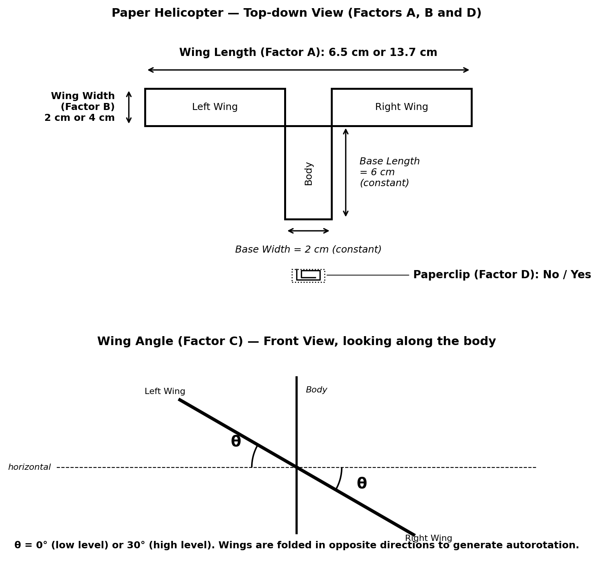
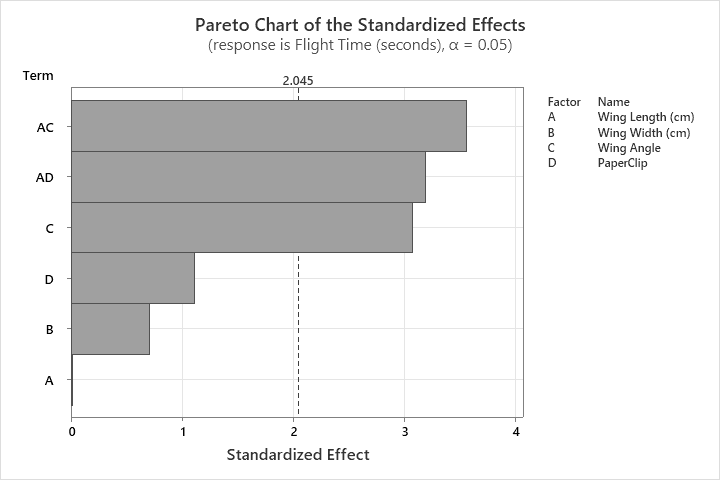
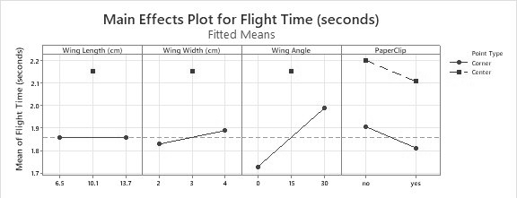
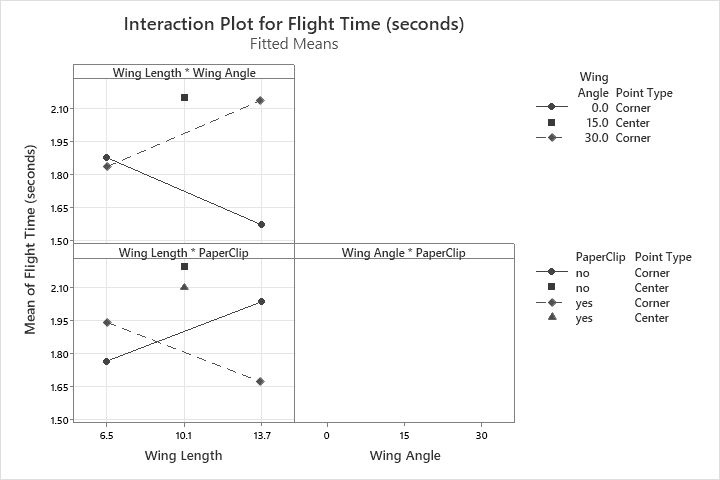
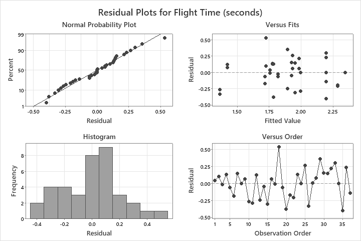
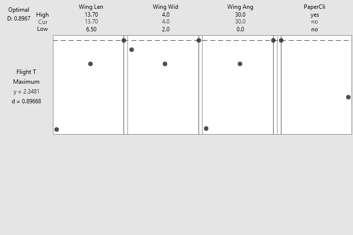
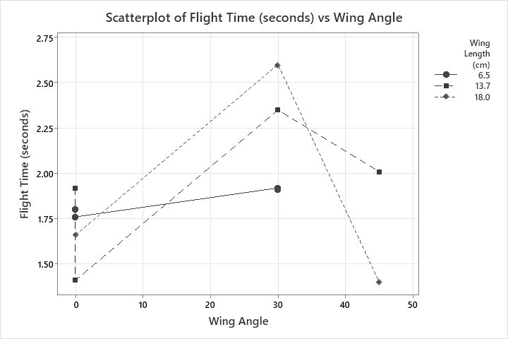

# Factorial Design of Experiment : Optimising Paper Helicopter Flight Time

A two-level full factorial designed experiment to maximise flight time,
including ANOVA, interaction analysis, curvature testing, response
optimisation, and a sensitivity study beyond the design region.

**Domain:** design of experiments · statistical process optimisation
**Tools:** Minitab 21
**Design:** 2⁴ full factorial (16 combinations × 2 replicates = 32 runs) + 5 centre points + 4 sensitivity runs

**Competencies demonstrated:** experimental design · analysis of variance · interaction and curvature analysis · regression modelling · response optimisation · engineering interpretation of statistical results

---

## Overview

Design of experiments (DOE) is a structured method for learning how multiple
factors jointly affect a response, using the minimum number of runs. This study
uses a paper helicopter, a standard vehicle for demonstrating rigorous DOE
practice (Box, 1992), to find the wing geometry that maximises flight time
from a fixed 3.015 m drop.

Four factors were tested at two levels each: wing length (6.5–13.7 cm), wing
width (2–4 cm), wing angle (0–30°), and the presence of a paperclip. A full
factorial was chosen over a fractional design because four factors give only
sixteen combinations, enough to estimate every main effect and interaction
without confounding.

The full dataset is in [`data/`](data/) and the analysis figures in
[`figures/`](figures/).

*Figure 1. The paper helicopter: wing length (A), wing width (B), wing angle (C), and paperclip (D), with base dimensions held constant. The opposite wing folds produce the autorotation that slows descent. Adapted from Box (1992).*

## Design

Table 1. The four factors and their two levels in the 2⁴ full factorial design.
| Factor | Symbol | Low (−1) | High (+1) |
|---|:---:|:---:|:---:|
| Wing length | A | 6.5 cm | 13.7 cm |
| Wing width | B | 2 cm | 4 cm |
| Wing angle | C | 0° | 30° |
| Paperclip | D | No | Yes |

Each of the sixteen combinations was built and dropped twice; this replication
estimates the run-to-run variability against which each effect is judged. Run
order was randomised so that slow drifts (builder fatigue, air movement) would
not align with any factor. Five centre points were added to test for curvature
between the corners. Base length, base width, and drop height were held constant
(6 cm, 2 cm, 3.015 m) so any change in flight time is attributable to the four
factors alone.

> **Method rationale.** A full factorial was chosen deliberately: with only four
> factors, the sixteen runs estimate every interaction without the confounding a
> fractional design would introduce. Replication provides the error estimate;
> randomisation protects against time-correlated nuisance effects; centre points
> add the single degree of freedom needed to detect curvature that a two-level
> design otherwise cannot see. Each design choice answers a specific threat to
> the validity of the result.

## Results

The fitted model is significant (F = 6.10, p < 0.001) and explains 59.6% of the
variation (adjusted 49.8%). Including every interaction raised the raw fit to
77.4% but lowered its predictive value, a sign of terms fitting noise, so the
smaller model was kept.

Table 2. Analysis of variance for the fitted model.
| Source | DF | Adj SS | Adj MS | F | P |
|---|:---:|:---:|:---:|:---:|:---:|
| Model | 7 | 2.4542 | 0.3506 | 6.10 | 0.000 |
| Wing angle (C) | 1 | 0.5408 | 0.5408 | 9.42 | 0.005 |
| Wing length × wing angle (AC) | 1 | 0.7260 | 0.7260 | 12.64 | 0.001 |
| Wing length × paperclip (AD) | 1 | 0.5832 | 0.5832 | 10.15 | 0.003 |
| Curvature | 1 | 0.3312 | 0.3312 | 5.77 | 0.023 |
| Error | 29 | 1.6655 | 0.0574 | | |
| Total | 36 | 4.1197 | | | |

*S = 0.240; R² = 59.6%; R²(adj) = 49.8%; R²(pred) = 34.4%.*

**Significant effects.** Wing angle was the only significant main effect
(p = 0.005). The strongest terms were two interactions, wing length × wing
angle (p = 0.001) and wing length × paperclip (p = 0.003), so wing length and
the paperclip act only in combination, not alone.

*Figure 2. Pareto chart of the standardized effects: AC, AD, and C cross the significance threshold.*

**Curvature.** The five centre points averaged 2.20 s against a corner mean of
1.86 s, and curvature was significant (F = 5.77, p = 0.023). Flight time
therefore peaks toward the middle of the region, not at the extreme settings.

*Figure 3. Main effects plot with the centre point (square) overlaid; it sits above the corner line for every factor, visualising the significant curvature.*

**Interactions and engineering interpretation.** The interaction plot shows
non-parallel (crossing) lines for both significant interactions.

*Figure 4. Interaction plot for flight time; crossing lines confirm both interactions.*

Wing length barely matters when the wings are flat (0°) but improves flight time
strongly when pitched to 30°: pitched wings set up the autorotation the design
relies on, and a longer wing acts on a longer arm to develop more rotational
drag (Leishman, 2006), whereas flat wings barely spin. The paperclip lengthens
flight slightly on short wings but shortens it on long ones, its added mass
raises descent speed and, on a long pitched wing, suppresses autorotation, so
the clip is harmful exactly where the helicopter performs best.

**Model adequacy.** Residuals lie close to the line on the normal probability
plot, scatter evenly about zero against fitted values, and form a roughly
symmetric histogram. The largest standardised residual (2.52) is within the
expected range for 37 runs and was retained.

*Figure 5. Residual plots supporting the model assumptions.*

## Optimisation and sensitivity

The optimiser returned wing length 13.7 cm, wing width 4 cm, wing angle 30°, no
paperclip (fitted 2.35 s, desirability 0.90). Every continuous factor sat at its
upper limit, meaning the response was still rising at the region edge, so a
sensitivity study probed beyond the design boundaries.

*Figure 6. Response optimisation: the maximum sits at the upper edge of every continuous factor.*

At an 18 cm wing, flight time rose from 1.66 s at 0° to **2.60 s at 30°**, the
longest recorded, then fell to 1.40 s at 45° as the rotor stalled and
rotational drag collapsed (Leishman, 2006). The straight-line model
overestimated the 45° flight by over a second, confirming that a curved model
and wider region are needed to capture the true peak.

*Figure 7. Sensitivity study: the 18 cm wing peaks at 30° then stalls at 45°.*

> **Interpretation.** The value here is not the winning helicopter but the
> reasoning: the analysis distinguishes real structure from noise (rejecting the
> over-fitted full model), reads the interactions back into physical mechanism
> (autorotation, rotor stall), and recognises from the optimiser output that the
> true optimum lies outside the tested region, then tests that boundary rather
> than reporting the edge as the answer.

## Conclusions and recommendations

Within the region tested, the longest flights came from wing length 13.7 cm,
wing width 4 cm, wing angle 30°, no paperclip (observed mean 2.35 s). Wing angle
controls the response through autorotation; wing length and paperclip act
through interactions. The response is curved and still rising at the edge, with
the true peak lying beyond it, near an 18 cm wing pitched between roughly
20–30°.

Three next steps:
1. Run a second stage adding runs just beyond the present settings to fit a curved model and locate the true optimum (Box and Wilson, 1951).
2. Replace the present/absent paperclip with a base weight varied in small steps, so the effect of mass can itself be tested for curvature.
3. Replace the stopwatch with a light gate or video timing to reduce reaction-time error.

## Data

- [`data/factorial_32_runs.csv`](data/factorial_32_runs.csv) : the full 2⁴ dataset (32 runs).
- [`data/centre_points.csv`](data/centre_points.csv) : five centre-point runs used in the curvature test.
- [`data/sensitivity_runs.csv`](data/sensitivity_runs.csv) : four runs beyond the design boundary.

## References

- Box, G.E.P. (1992) 'Teaching engineers experimental design with a paper helicopter', *Quality Engineering*, 4(3), pp. 453–459.
- Box, G.E.P. and Wilson, K.B. (1951) 'On the experimental attainment of optimum conditions', *Journal of the Royal Statistical Society: Series B*, 13(1), pp. 1–45.
- Leishman, J.G. (2006) *Principles of Helicopter Aerodynamics*. 2nd edn. Cambridge: Cambridge University Press.
- Montgomery, D.C. (2017) *Design and Analysis of Experiments*. 9th edn. Hoboken, NJ: John Wiley & Sons.
- Myers, R.H., Montgomery, D.C. and Anderson-Cook, C.M. (2016) *Response Surface Methodology*. 4th edn. Hoboken, NJ: John Wiley & Sons.
